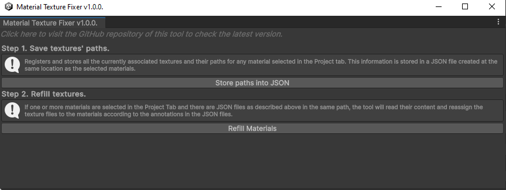
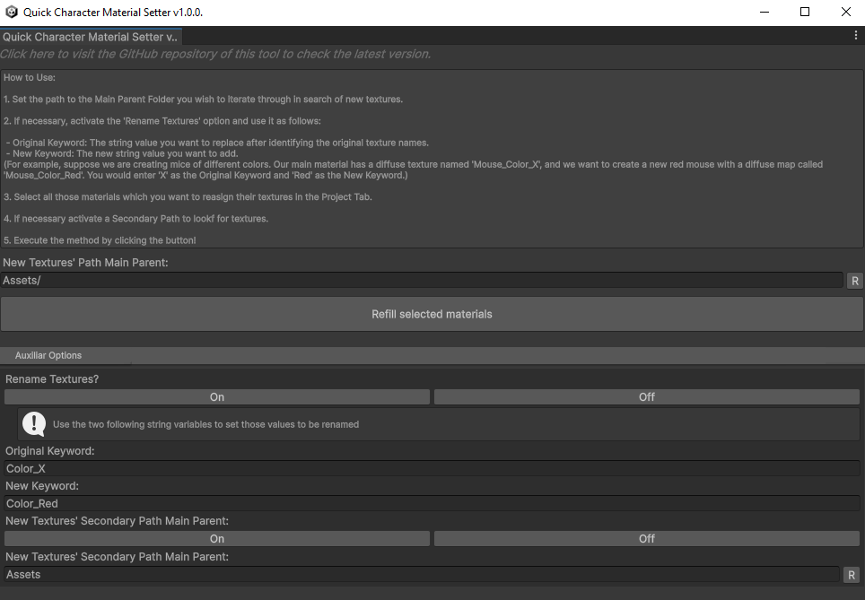

# Unity Material Texture Tools

_A repository of different tools to use in Unity 3D to deal with materials and textures in multiple ways. Subject to updates in the future._

_I created these tools to assist users in correcting potential issues with missing textures when importing Unity packages containing files for different Render Pipelines or preparing the Packages themselves for later distribution._

_Nevertheless, these tools could have other potential uses, such as:_

* _Serving as the foundation for an efficient tool to convert materials between different Render Pipelines._

* _Transforming materials in Unity projects that contain shaders and materials originally converted from Unreal projects. Often, vendors do not update to the most efficient shaders and instead use default ones for these conversions._

## **Material Texture Fixer (v1.0.0):**

  
Click to expand!

  
This Unity editor script, is crafted to simplify the process of managing and restoring material textures in Unity projects. Accessible through "Tools/Ahab Tools/Material Texture Fixer" in the Unity Editor, this script provides a structured approach to saving and refilling textures for materials. 

### **Features and Workflow**

  
Click to expand!

**Custom Editor Window:**

* A user-friendly interface is presented within a custom editor window. This interface includes buttons, labels, and information boxes that guide you through the texture management process.

**Saving Textures' Paths:**

* You can save the paths of all textures associated with selected materials into a JSON file. This file is stored in the same location as the materials, making it easy to track and manage texture information.

**Refilling Textures from JSON:**

* If materials are selected and a corresponding JSON file is available in the same directory, the script can read this file to reassign the appropriate textures to the materials based on the saved data. This functionality ensures consistency and simplifies the process of texture management across different sessions or projects.

### **How to Use**

1\. Open the Editor Window:

* Navigate to "Tools/Ahab Tools/Material Texture Fixer" in Unity’s top menu to open the editor window.

2\. Step 1: Save Textures' Paths:

* Click the "Store paths into JSON" button after selecting the materials in the Project tab. This action will register and store the paths of all textures related to the selected materials in a JSON file.

3\. Step 2: Refill Textures:

* With materials selected and the JSON file in place, press the "Refill Materials" button. The script will automatically assign the textures according to the data in the JSON file, effectively restoring the original texture settings of the materials.

  
Click to see screenshot!

  

## **Quick Character Material Setter (v1.0.0):**

  
Click to expand!

This Unity editor script,  is designed to streamline the process of updating materials with new textures within Unity. It provides functionality through a custom editor window, which you can access under "Tools/Ahab Tools/Quick Character Material Setter" in the Unity Editor menu. 

### **Features and Workflow**

  
Click to expand!

**Custom Editor Window:**

* The script creates a custom editor window that provides a user-friendly interface for performing texture updates on materials. This window includes input fields, buttons, and informative text to guide you through the process.

**Texture Path Configuration:**

* You can specify the path where new textures are located. There's an option to automatically set this path to the currently selected folder in the Unity Project tab, enhancing your workflow efficiency.

**Texture Renaming:**

* The tool supports renaming textures based on keywords. You can specify an "Original Keyword" to look for in texture names and a "New Keyword" to replace it with. This feature is particularly useful for batch renaming textures to conform to new naming conventions or to specify texture types.

**Secondary Texture Path:**

* Optionally, you can specify a secondary path to look for textures, increasing the likelihood of finding the correct resources when they are not all stored in a single directory.

**Material Update:**

* Once paths and renaming rules are set, you can apply these to selected materials. The script searches through the specified directories, finds matching textures, and assigns them to the appropriate texture properties of the selected materials.

### **How to Use**

1\. Open the Editor Window:

* Navigate to "Tools/Ahab Tools/Quick Character Material Setter" in Unity’s top menu to open the editor window.

2\. Configure Paths and Keywords:

* Enter the main path for new textures.
* If needed, enable and configure the secondary path.
* Set the original and new keywords for renaming textures.

3\. Select Materials:

* In the Unity Project tab, select the materials you want to update.

4\. Execute Updates:

* Click the "Refill selected materials" button to start the process. The script will update the materials with the new textures based on the configured settings.

  
Click to see screenshot!

  

